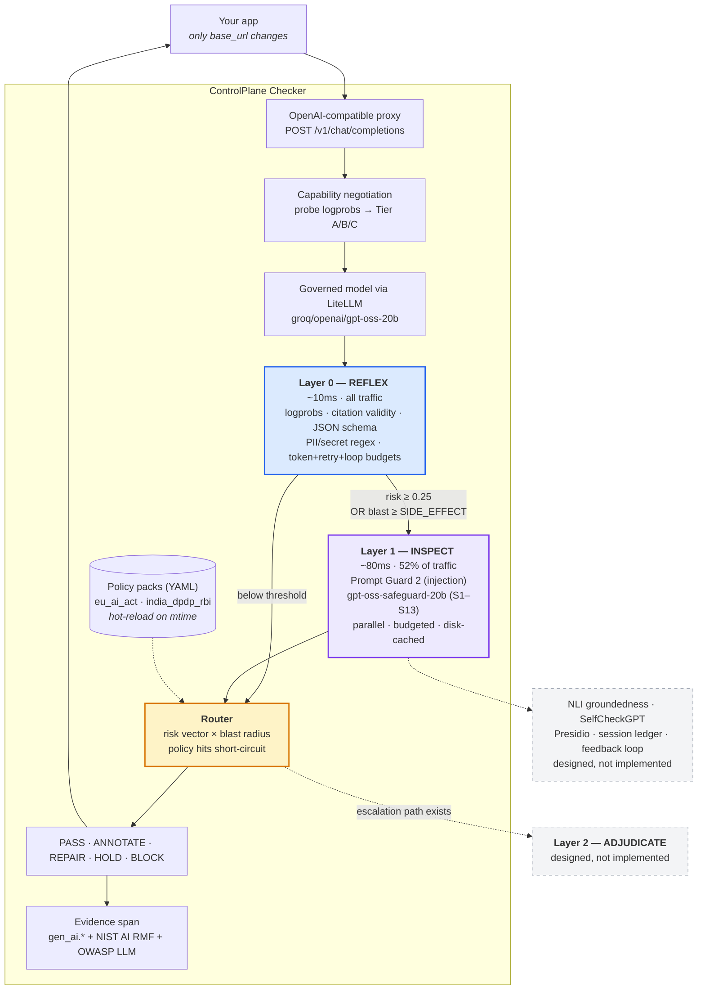
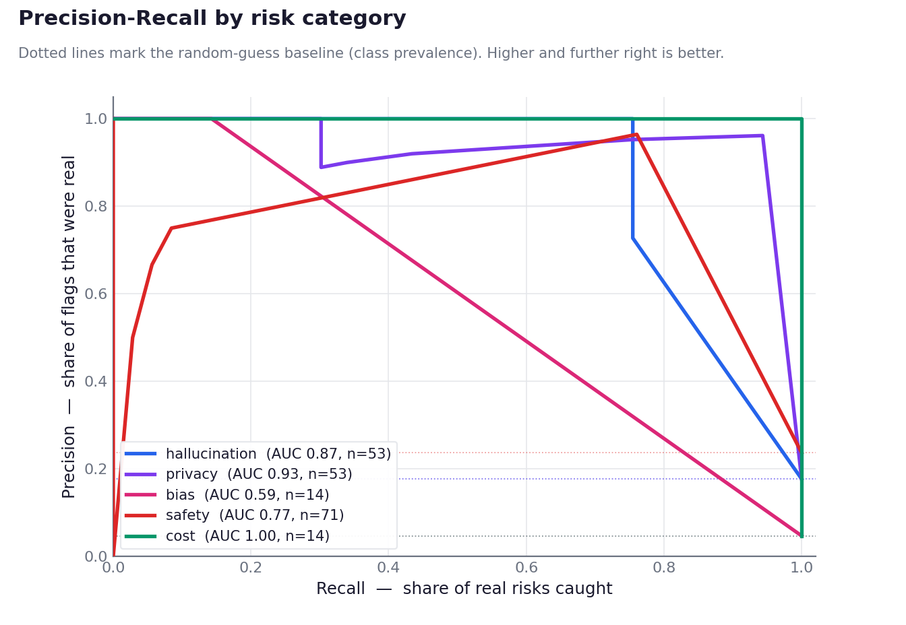
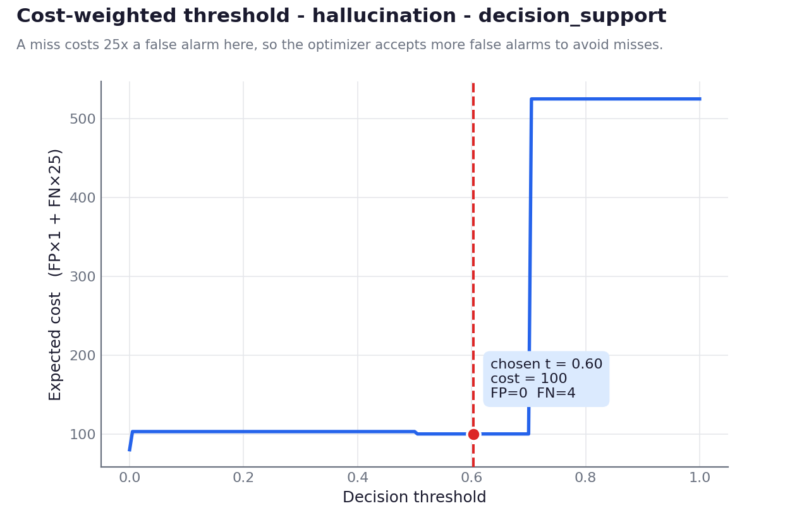
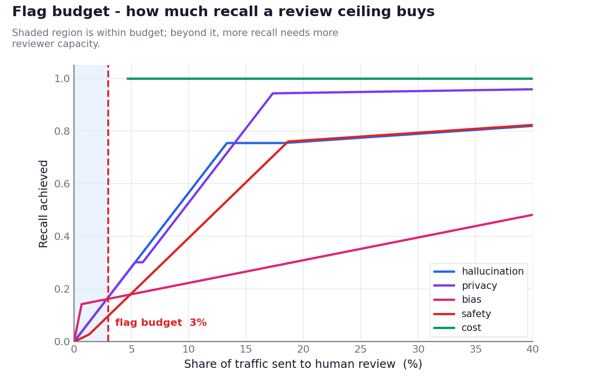

# ControlPlane Checker

**A verification layer that sits between any LLM and your application and spends
verification compute in proportion to consequence.** It runs a three-tier cascade —
cheap deterministic checks on every response, guard models only on elevated-risk ones —
and routes each response on a multi-label risk vector crossed with *blast radius*
(what acting on the answer actually does), never a single score. It exposes an
OpenAI-compatible endpoint, so an existing application is governed by changing one line:
its `base_url`.

_Accenture Innovation Challenge 2026 — Round 2. Track: ControlPlane.ai._

> **Status: working prototype.** Layers 0 and 1, the router, the policy engine, and the
> eval/tuning pipeline are built and measured. Several designed components are **not**
> implemented — they are listed under [Known limitations](#known-limitations) and in
> [`ASSUMPTIONS.md`](ASSUMPTIONS.md). All data is synthetic.

---

## What actually runs



**The router never collapses to one number.** Five labels — `hallucination`, `privacy`,
`bias`, `safety`, `cost` — are tracked independently and co-fire. A fabricated detail
about a person is a hallucination *and* a privacy incident, and the system says so.

| risk score | INFORMATIONAL | ADVISORY | SIDE_EFFECT | IRREVERSIBLE |
|---|---|---|---|---|
| **< 0.30** | PASS | PASS | PASS | HOLD |
| **0.30–0.60** | ANNOTATE | ANNOTATE | HOLD | HOLD |
| **> 0.60** | ANNOTATE | ANNOTATE | HOLD | BLOCK + handoff |
| **policy hit** | REPAIR | REPAIR | BLOCK | BLOCK |

---

## Quickstart

**Requires Python 3.11 or 3.12.** No `make`, no Docker, no GPU.

```bash
git clone <repo-url> controlplane-checker
cd controlplane-checker

cp .env.example .env              # add your GROQ_API_KEY
pip install -r requirements.txt   # CPU-only, 83 packages

python scripts/demo.py --offline  # <-- start here: ~0.03s, no API calls, no server
```

That is the whole judge path. To exercise the live proxy as well:

```bash
uvicorn controlplane.proxy.app:app --port 8000
```

Then govern any existing call by pointing it at the proxy:

```bash
curl -s http://localhost:8000/v1/chat/completions \
  -H "Content-Type: application/json" \
  -H "x-controlplane-policy-pack: india_dpdp_rbi" \
  -H "x-controlplane-usecase: customer_support_chat" \
  -H "x-controlplane-blast-radius: ADVISORY" \
  -d '{"messages":[{"role":"user","content":"What is a control plane?"}]}'
```

The reply is a standard OpenAI object plus one additive block:

```jsonc
{
  "choices": [ /* ... unchanged OpenAI shape ... */ ],
  "controlplane": {
    "action": "PASS",
    "risk_vector": {"hallucination": 0.0, "privacy": 0.0, "bias": 0.0,
                    "safety": 0.0, "cost": 0.0},
    "signals": [], "layer_reached": 0,
    "blast_radius": "ADVISORY", "capability_tier": "C", "degraded": true,
    "policy_pack": "india_dpdp_rbi", "policy_rule": "",
    "latency_ms": {"added": 0.17, "reflex": 0.10, "model": 650.1}
  }
}
```

Clients that don't know about `controlplane` ignore it and keep working.

### The demo

```bash
python scripts/demo.py --offline
```

Runs from cached guard verdicts: **~0.03 s, zero API calls, deterministic across runs**
(verified by running it with an invalid API key — the verdicts are unchanged). Offline is
the default, so a bare `python scripts/demo.py` behaves identically.

Add `--live` to call a running proxy for the first scene instead of using the recorded
response. If you have GNU Make installed, `make demo` is a convenience alias — but Make is
not required anywhere in this project.

---

## Eval harness and tuner

```bash
# generate 300 labeled synthetic cases -> data/eval_set.jsonl
python -m controlplane.eval.generate_dataset

# run the cascade offline: instant, zero API calls
python -m controlplane.eval.harness --offline

# PR curves + cost-weighted thresholds, written back into the policy pack
python -m controlplane.eval.optimizer --write-pack

# optional: re-run against live guard models to repopulate the cache
python -m controlplane.eval.harness
```

Equivalent Make aliases exist (`make dataset`, `make eval`, `make tune`, `make eval-live`)
if you have Make; they are optional.

The harness reports precision/recall/F1 and a confusion matrix per risk label, plus p50/p95
**added** latency reported separately from model latency:

```
label             thr  supp    prec     rec      F1     FPR   TP   FP   FN   TN
hallucination    0.60    53   1.000   0.755   0.860   0.000   40    0   13  247
privacy          0.36    53   0.962   0.943   0.952   0.008   50    2    3  245
bias             0.46    14   1.000   0.143   0.250   0.000    2    0   12  286
safety           0.40    71   0.964   0.761   0.850   0.009   54    2   17  227
cost             0.50    14   1.000   1.000   1.000   0.000   14    0    0  286

hard-negative false positives: 2/81 = 2.5%   (50% before tuning)
ADDED latency: p50 0.34 ms · p95 1.12 ms   (Layer 0 budget: 10 ms)
```

Rate limits are designed around, not fought: guard models run **only on escalated
cases**, every verdict is cached to disk keyed on a content hash, `--offline` never
touches the network, and `--limit N` subsamples for iteration.

### The three figures

Precision–recall per risk category, over 300 labeled cases:



The cost-weighted threshold choice. A miss in decision support costs 25× a false alarm,
so the optimizer accepts more false alarms — and the cliff at 0.70 is where misses start:



What a review-capacity ceiling actually buys you in recall:



---

## Swapping policy packs

Packs live in [`controlplane/policy/packs/`](controlplane/policy/packs/) as versioned
YAML and **hot-reload on file mtime** — edit and save, no restart. Select one per request
with the `x-controlplane-policy-pack` header.

Each pack defines three use-case profiles (`customer_support_chat` 150 ms,
`internal_copilot` 800 ms, `decision_support` 5000 ms), each carrying `risk_appetite`,
`latency_budget_ms`, `flag_budget_pct`, `fail_open`, and per-label thresholds.

The same input reaches different verdicts under different packs — from YAML, not code:

| input | `eu_ai_act` | `india_dpdp_rbi` |
|---|---|---|
| PAN + email in output @ ADVISORY | `REPAIR` (EU-GDPR-PII) | `BLOCK` (DPDP-SENSITIVE-ID, not repairable) |
| Financial action @ IRREVERSIBLE, **risk 0.00** | `HOLD` | `BLOCK` (RBI-FREEAI-HUMAN-LOOP) |

The second row is the interesting one: zero measured risk, and India still blocks,
because RBI FREE-AI expects a human decision-maker for customer-affecting financial
actions regardless of model confidence. Blast radius drives that, not the score.

To add a jurisdiction, copy a pack, edit the rules, and send its `pack_id` in the header.
A pack that fails validation is rejected and the last good version stays live.

---

## Known limitations

Stated plainly, because a governance tool that overstates itself is the problem it claims
to solve. Full detail in [`ASSUMPTIONS.md`](ASSUMPTIONS.md).

- **We do not claim bias coverage.** Bias recall is **0.143**. Layer 0 has no fairness
  detector at all, and the guard model only catches blatant cases. Subtle
  protected-attribute reasoning passes.
- **Designed but not implemented:** NLI groundedness, SelfCheckGPT semantic entropy,
  Presidio NER, the session risk ledger, feedback recalibration, the Phoenix/OTLP
  collector, the Streamlit console, and the Layer 2 human queue. Spans are emitted in
  the correct shape but not exported to a running collector.
- **The eval set is enriched to 40% risky** so every label has enough support to measure.
  Production traffic is mostly benign, so all headline numbers use *projected* prevalence
  (1.9% flagged at 1% real risk; 3.3% at 3%), never the raw 34% enriched figure.
- **The 3% flag budget is infeasible on the enriched set, and the tool says so** rather
  than suppressing detection to appear compliant.
- **Groq model substitutions.** `llama-3.1-8b-instant` and `llama-guard-4-12b` are retired;
  the governed model is `openai/gpt-oss-20b` (config-driven, one-line swap) and the guards
  are `llama-prompt-guard-2-86m` + `gpt-oss-safeguard-20b`. This provider exposes no
  logprobs, so the live path is **Tier C** and degrades accordingly.
- Detector thresholds are tuned on 300 **synthetic** cases. They are a demonstration of
  method, not production-calibrated values.

## Tech stack

Python 3.11-3.12 · FastAPI · Pydantic · LiteLLM · Groq (`gpt-oss-20b`,
`llama-prompt-guard-2-86m`, `gpt-oss-safeguard-20b`) · scikit-learn · matplotlib ·
pytest. **CPU-only, no GPU, no training.** Deferred ML dependencies are isolated in
[`requirements-future.txt`](requirements-future.txt) so a clean install stays small.

## Repository map

| path | what |
|---|---|
| `controlplane/proxy/app.py` | OpenAI-compatible FastAPI proxy |
| `controlplane/detectors/reflex.py` | Layer 0 — free signals |
| `controlplane/detectors/guard_model.py` | Prompt Guard + Safeguard, cached, backoff |
| `controlplane/detectors/tier1.py` | Layer 1 orchestration, budgets, fail-open/closed |
| `controlplane/router/decision.py` | confidence × blast-radius matrix |
| `controlplane/policy/engine.py` | pack loading, validation, hot reload |
| `controlplane/eval/` | dataset generator, harness, threshold optimizer |
| `scripts/demo.py` | the scripted demo |
| `BUSINESS_PROPOSAL.md` | problem framing, buyers, business case, roadmap |

## Data & safety

All data is **synthetic and illustrative**. Names are invented; every PAN, Aadhaar, card,
phone and email is a fabricated or documentation-range value. No real personal or
enterprise data appears anywhere in this repository.

## License

[MIT](LICENSE).
